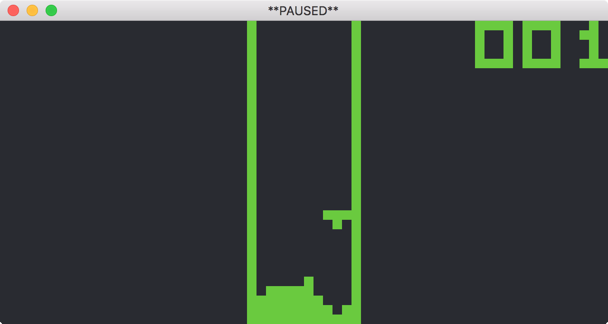

# Chip-8 Interpreter
A simple Chip-8 interpreter written as an exercise in learning more about emulation, Git(Hub), and the C++ language in general. The project uses [SFML](https://github.com/SFML/SFML) for graphics/audio and [cxxopts](https://github.com/jarro2783/cxxopts) for option parsing.

Currently, only base Chip-8 programs are supported (i.e. no Super Chip-8).

## Screenshot

## Building
Building the project requires the following:
* C++11 compiler
* SFML (developed with [2.4.2](https://www.sfml-dev.org/download/sfml/2.4.2/))
* [CMake](https://cmake.org) 3.11+

### macOS/Linux

    $ git clone https://github.com/sambrla/chip-8.git
    $ cd chip-8
    $ mkdir build
    $ cd build
    $ cmake -D CMAKE_BUILD_TYPE=Release ..
    $ make

### Windows (Visual Studio)

    > git clone https://github.com/sambrla/chip-8.git
    > cd chip-8
    > mkdir build
    > cd build
    > cmake -D SFML_ROOT=<path\to\SFML> ..
    > cmake --build . --config Release

## Usage
Run the interpreter by passing it a ROM file, e.g.

    $ ./chip8 roms/myRom.ch8

Optional arguments may be specified to control execution speed (IPC), support high DPI displays, and toggle compatibility.

    -i, --ipc IPC   Instructions to execute per cycle (default: 20)
    -r, --high-dpi  Scale window for high DPI displays
    -c, --compat    Enable alternate shift and load behaviour. May be required
                    for some ROMs to work correctly
    -h, --help      Print help

## Key map
The hex-based keypad used on OG hardware has been mapped as follows:

    1  2  3  C                   1  2  3  4
    4  5  6  D     Mapped to     Q  W  E  R
    7  8  9  E        -->        A  S  D  F
    A  0  B  F                   Z  X  C  V

The interpreter can be paused by pressing <kbd>Ctrl+P</kbd> and reset by pressing <kbd>Ctrl+R</kbd>.

## Resources
* [Mastering Chip-8](http://mattmik.com/files/chip8/mastering/chip8.html)
* [Octo](https://github.com/JohnEarnest/Octo)
* [Chip-8 Reference Manual (PDF)](http://chip8.sourceforge.net/chip8-1.1.pdf)
